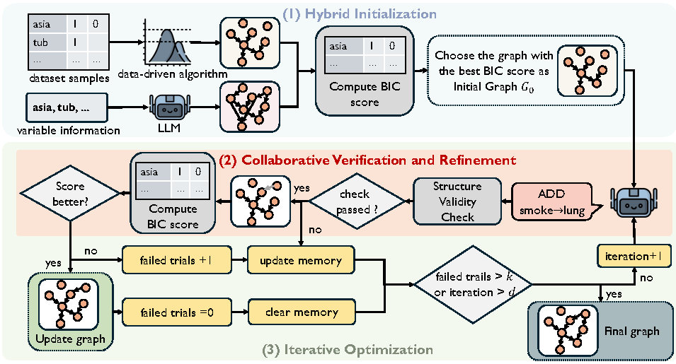

# CauScientist
Implementation for paper CauScientist: Teaching LLMs to Respect Data for Causal Discovery.

We propose CauScientist, a collaborative framework that synergizes LLMs as hypothesis-generating "data scientists" with probabilistic statistics as rigorous "verifiers". CauScientist employs hybrid initialization to select superior starting graphs, iteratively refines structures through LLM-proposed modifications validated by statistical criteria, and maintains error memory to guide efficient search space. 

Code will be released soon.